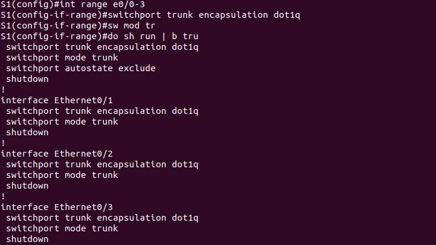

# Лабораторная работа. Развертывание коммутируемой сети с резервными каналами
## Топология

## Таблица адресации

| Устройство | Интерфейс | IP-адрес    | Маска подсети | 
| ---------- |:---------:|:-----------:|:-------------:|
| S1         | VLAN 1    | 192.168.1.1 | 255.255.255.0 |
| S2         | VLAN 1    | 192.168.1.2 | 255.255.255.0 |
| S3         | VLAN 1    | 192.168.1.3 | 255.255.255.0 |

## Часть 1. Создание сети и настройка основных параметров устройства

### Шаг 1. Создайте сеть согласно топологии.

   Подключите устройства, как показано в топологии, и подсоедините необходимые кабели.


### Шаг 2: Выполните инициализацию и перезагрузку коммутаторов.

### Шаг 3: Настройте базовые параметры каждого коммутатора.


### Шаг 4: Проверьте связь.


## Часть 2: Определение корневого моста

### Шаг 1: Отключите все порты на коммутаторах.


   
### Шаг 2: Настройте подключенные порты в качестве транковых.




### Шаг 3: Включите порты E0/1 и E0/3 на всех коммутаторах.


### Шаг 4: Отобразите данные протокола spanning-tree.


   В схему ниже запишите роль и состояние (Sts) активных портов на каждом коммутаторе в топологии.


   С учетом выходных данных, поступающих с коммутаторов, ответьте на следующие вопросы.


   Какой коммутатор является корневым мостом? 

```
Коммутатор S1 является корневым мостом.
```

   Почему этот коммутатор был выбран протоколом spanning-tree в качестве корневого моста?

```
S2 имеет самый низкий MAC-адрес.
```

   Какие порты на коммутаторе являются корневыми портами?

```
На S2 - E0/1, на S3 - E0/3.
```

   Какие порты на коммутаторе являются назначенными портами?

```
На S1 - E0/1 и E0/3, на S3 - E0/1.
```

   Какой порт отображается в качестве альтернативного и в настоящее время заблокирован?

```
На S2 - E0/3.
```

   Почему протокол spanning-tree выбрал этот порт в качестве невыделенного (заблокированного) порта?

```
Так как S2 имеет MAC-адрес больше, чем S3.
```

## Часть 3: Наблюдение за процессом выбора протоколом STP порта, исходя из стоимости портов

### Шаг 1: Определите коммутатор с заблокированным портом.

```
   Заблокирован порт на S1
```

### Шаг 2: Измените стоимость порта.


### Шаг 3: Просмотрите изменения протокола spanning-tree.


   
### Шаг 4: Удалите изменения стоимости порта.


## Часть 4: Наблюдение за процессом выбора протоколом STP порта, исходя из приоритета портов

   a. Включите порты E0/0 и E0/2 на всех коммутаторах.


   b. Подождите 30 секунд, чтобы протокол STP завершил процесс перевода порта, после чего выполните команду show spanning-tree на коммутаторах некорневого моста. 


   Какой порт выбран протоколом STP в качестве порта корневого моста на каждом коммутаторе некорневого моста? 

```
На S2 - порт E0/0, на S3 - порт E0/2
```

   Почему протокол STP выбрал эти порты в качестве портов корневого моста на этих коммутаторах?

```
Они имеют наименьший порядковый номер порта среди портов, подключенных к корневому мосту,  
при прочих равных условиях.
```

## Вопросы для повторения

   1.Какое значение протокол STP использует первым после выбора корневого моста, чтобы определить выбор порта?

```
Стоимость пути
```

   2. Если первое значение на двух портах одинаково, какое следующее значение будет использовать протокол STP при выборе порта?

```
MAC-адрес коммутатора
```

   3. Если оба значения на двух портах равны, каким будет следующее значение, которое использует протокол STP при выборе порта?

```
Порядковый номер порта на коммутаторе
```
